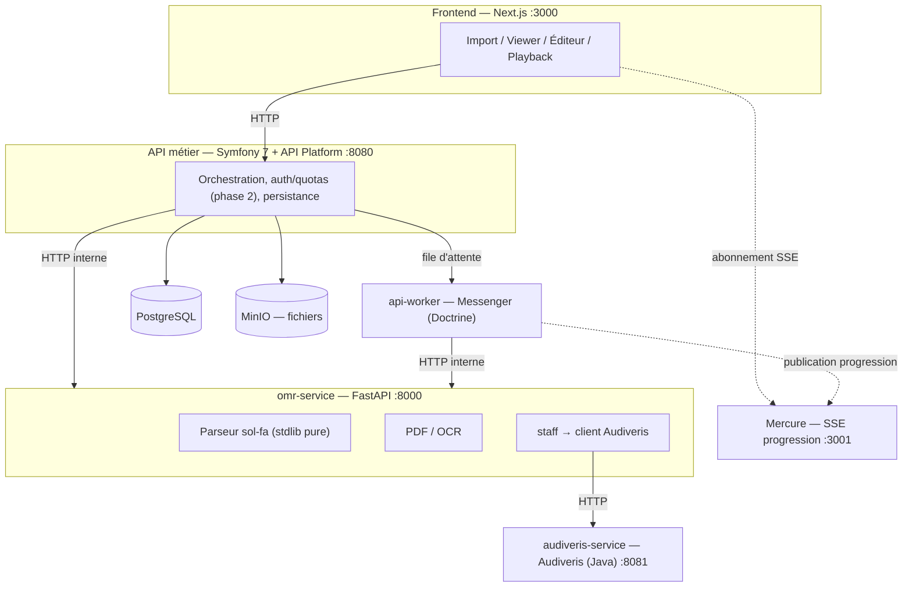

# Moozika

**Moozika** convertit des partitions musicales entre la **portée classique** (solfège occidental)
et le **sol-fa tonique malgache** (notation *mouvable-do* — `d r m f s l t` + marques d'octave —
utilisée pour les *fihirana*), dans les **deux sens**. Le projet reconnaît aussi bien une portée
scannée qu'une feuille sol-fa (PDF ou image, typographiée ou manuscrite), et permet ensuite de
lire, jouer et éditer le résultat directement dans le navigateur.

Projet à but non lucratif, construit avec des briques open source.

## Ce que ça fait

- **Import** — PDF ou image, portée classique ou sol-fa malgache, typographié ou scanné.
- **Reconnaissance** — OCR/OMR bidirectionnel : portée → notation, et notation → portée.
- **Conversion** — entre les deux notations, tonalité (*Doh =*) préservée comme métadonnée
  explicite plutôt que devinée.
- **Lecture** — playback piano dans le navigateur (Tone.js).
- **Édition** — correction du modèle reconnu avant sauvegarde.
- **Bibliothèque** — sauvegarde et rechargement des partitions (PostgreSQL + MinIO).

## Comment ça marche

Tout gravite autour de **MusicXML** comme format pivot canonique — chaque module ne connaît que ce
format, jamais le texte sol-fa brut n'est traité comme source de vérité. Ça permet de remplacer un
composant (ex. le moteur OMR) sans toucher au reste du système.



**Règle d'or :** le navigateur ne parle **jamais** directement aux services Python — Symfony
(`apps/api`) est l'unique point d'entrée métier (auth, quotas, orchestration, persistance) et
appelle `omr-service` en HTTP interne. Symfony ne fait **aucun** traitement musical/IA lui-même.

Les deux sens de conversion ne sont pas symétriques :
- **`portée → MusicXML`** est un problème quasi résolu via **Audiveris** (moteur OMR Java établi).
- **`sol-fa → MusicXML`** n'a **aucun** outil sur étagère → parseur déterministe sur-mesure,
  développé pour ce projet (`apps/omr-service/app/solfa`).

## Stack technique

| App | Rôle | Stack |
| --- | --- | --- |
| [`apps/frontend`](apps/frontend) | Import, viewer double mode (portée + sol-fa), édition, playback | Next.js 14, TypeScript, Tailwind, OpenSheetMusicDisplay, Tone.js |
| [`apps/api`](apps/api) | Point d'entrée métier, orchestration, persistance | Symfony 7, API Platform, Doctrine, Messenger, Mercure |
| [`apps/omr-service`](apps/omr-service) | Sol-fa ⇄ MusicXML, routage PDF/OCR, client Audiveris | FastAPI, Python (cœur du parseur sol-fa : stdlib pure) |
| [`apps/audiveris-service`](apps/audiveris-service) | OMR portée → MusicXML | Audiveris 5.11 (Java), FastAPI |

Infra dev : PostgreSQL, MinIO (stockage objet des MusicXML), Mercure (SSE de progression),
Docker Compose.

## Démarrage rapide

Prérequis : Docker + Docker Compose.

```bash
git clone <url-du-repo> moozika
cd moozika
docker compose up --build
```

Une fois les conteneurs démarrés :

| Service | URL |
| --- | --- |
| Frontend | http://localhost:3000 |
| API Symfony | http://localhost:8080 |
| omr-service | http://localhost:8000 |
| audiveris-service | http://localhost:8081 |
| Console MinIO | http://localhost:9001 |
| Hub Mercure | http://localhost:3001/.well-known/mercure |

Pour lancer le frontend hors Docker, copier `apps/frontend/.env.example` en `.env.local` et
ajuster les URLs (`OMR_SERVICE_URL`, `NEXT_PUBLIC_API_URL`, `NEXT_PUBLIC_MERCURE_URL`).

## Structure du repo

Monorepo, chaque app gère ses propres dépendances indépendamment :

```
apps/
  frontend/            Next.js — UI
  api/                 Symfony — orchestration métier
  omr-service/         FastAPI — sol-fa ⇄ MusicXML, PDF/OCR
  audiveris-service/   FastAPI + Audiveris — portée → MusicXML
packages/
  shared-contracts/    contrats stables entre apps (formats, API, théorie musicale)
docs/
  architecture.md      décisions actées, diagrammes, roadmap phasée
  base_plan.md         vision produit initiale
scripts/
  quality/             porte de qualité pré-commit (déterministe, sans appel modèle)
```

## Développement

```bash
make test          # tests omr-service en local
make docker-test    # suite complète dans Docker
make lint           # pylint / phpstan+GrumPHP / eslint, les 3 stacks
make gate           # porte de qualité sur l'index git avant commit
```

Un hook pre-commit versionné (`make hooks`, une fois par clone) fait tourner les tests et
contrôles bloquants du seul stack touché par le commit. Détails complets — formule de score,
seuils, contraintes d'environnement — dans [`CLAUDE.md`](CLAUDE.md).

## Documentation

- [`docs/architecture.md`](docs/architecture.md) — architecture détaillée, décisions actées,
  roadmap phasée.
- [`docs/base_plan.md`](docs/base_plan.md) — vision produit initiale.
- [`packages/shared-contracts/music-theory.md`](packages/shared-contracts/music-theory.md) —
  théorie musicale → règles d'implémentation (hauteurs, rythme, mouvable-do, tonalité).
- [`packages/shared-contracts/solfa-format.md`](packages/shared-contracts/solfa-format.md) —
  format texte sol-fa, interface stable entre OCR, saisie manuelle et parseur.
- [`packages/shared-contracts/scores-api.md`](packages/shared-contracts/scores-api.md) et
  [`omr-stream.md`](packages/shared-contracts/omr-stream.md) — contrats API (scores, streaming SSE).
- [`CLAUDE.md`](CLAUDE.md) — conventions, règles non négociables, porte de qualité.

## État du projet

| Volet | État |
| --- | --- |
| `omr-service` (sol-fa ⇄ MusicXML, routage PDF) | Implémenté |
| `audiveris-service` (portée → MusicXML) | Implémenté |
| `api` (scores, PostgreSQL + MinIO) | Implémenté, sans auth utilisateur |
| `frontend` (import, viewer, édition, playback) | En cours |
| Auth / quotas / admin | Prévu phase 2 |

## Licence

Non définie pour l'instant — projet à but non lucratif.
