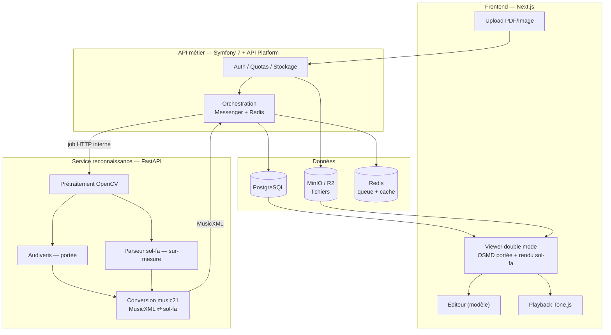
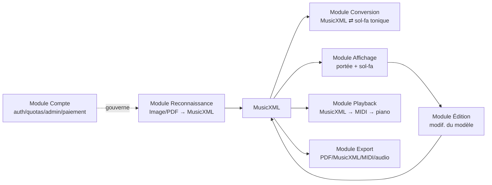
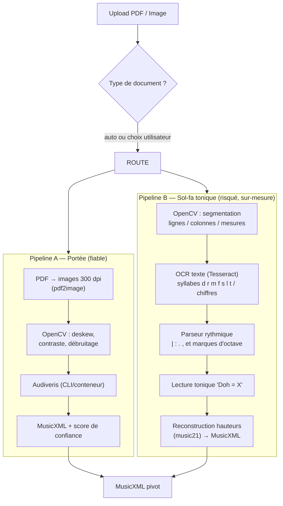
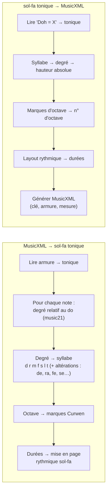
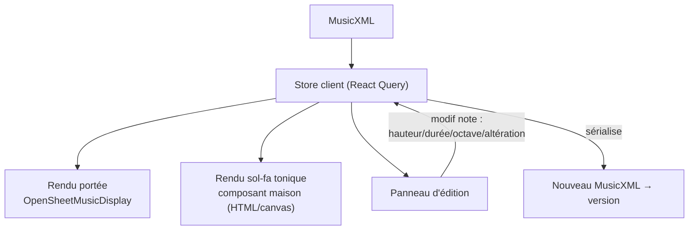
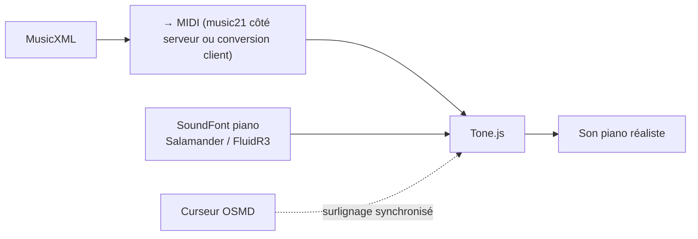
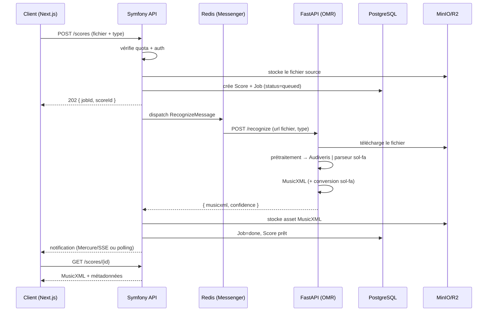
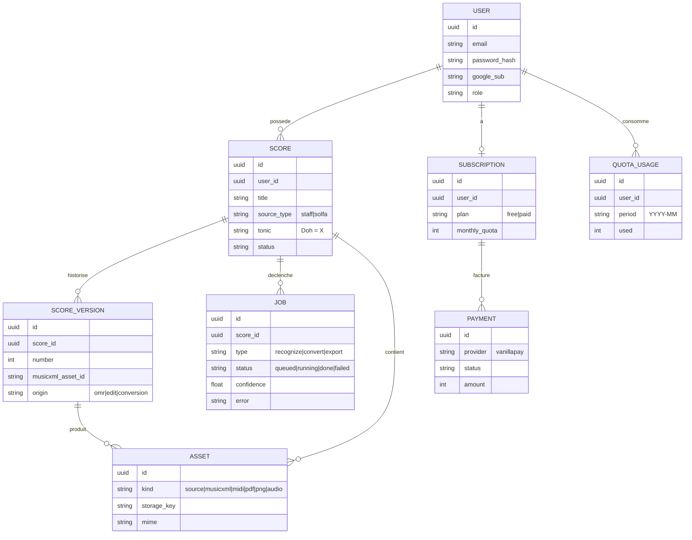
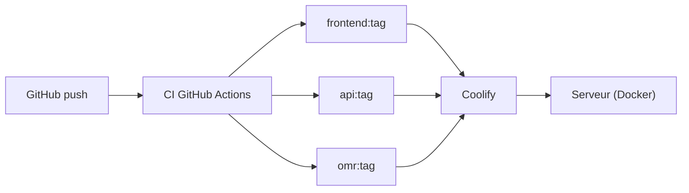
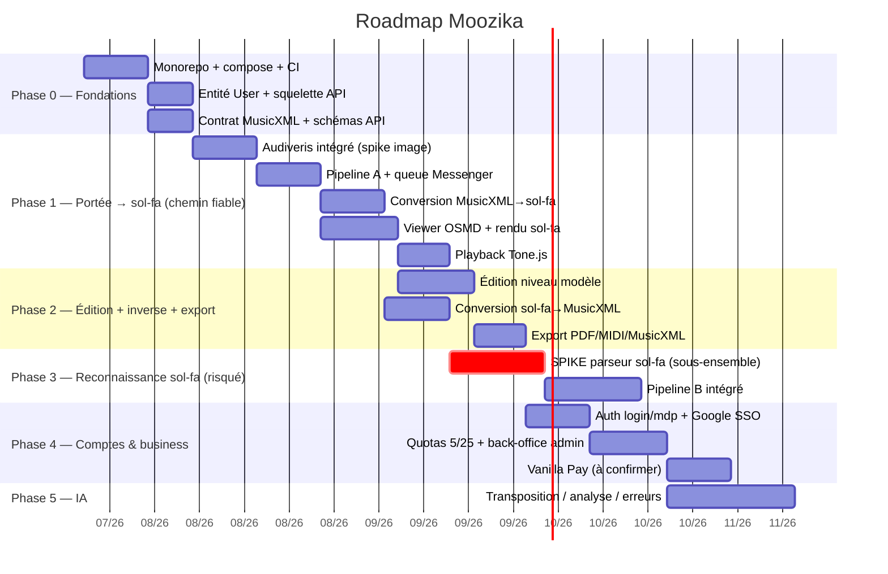

# Moozika — Architecture & Plan d'implémentation

> Document dérivé de [base_plan.md](base_plan.md), enrichi après clarification des points fonctionnels.
> **Pivot du système : MusicXML.** Tout gravite autour de ce format standard.

## 1. Décisions actées

| Sujet | Décision |
| --- | --- |
| Notations converties | **Portée classique ⇄ sol-fa tonique malgache** (mouvable-do : `d r m f s l t` + chiffres 1-7, notation des *fihirana*) |
| Sens d'import | **Les deux** : on reconnaît une portée **et** une feuille sol-fa |
| Moteur OMR (portée) | **Audiveris** (Java, encapsulé, sort du MusicXML) |
| Reconnaissance sol-fa | **Parseur/OCR sur-mesure** (aucun moteur existant) — composant à spiker |
| Périmètre v1 | Import + OMR + conversion + **playback** + **édition** |
| Format pivot | **MusicXML** (canonique, stocké) |
| Manipulation musicale | **music21** (Python) — voir §7 (écart assumé vs base_plan) |
| Auth / quotas / admin | Phase 2 (mais fondation `User` dès la Phase 0 — voir §11) |
| Stockage v1 (acté) | **PostgreSQL** + **MinIO** (MusicXML en objet) — pas MongoDB ; JSONB optionnel pour le snapshot UI (`ScoreModel`) |
| Auth app v1 | **Aucune** (bibliothèque globale locale) ; credentials MinIO/Postgres uniquement côté serveur |

### Conséquences structurantes

1. **L'asymétrie des deux sens.** `portée → MusicXML` est un problème quasi résolu (Audiveris). `sol-fa → MusicXML` n'a **aucun** outil sur étagère : le sol-fa tonique est du texte relatif à une tonique, pas des têtes de notes sur une portée. → pipeline dédié, risqué, à isoler.
2. **Le sol-fa tonique est *mouvable-do*** : relatif à la tonalité. Convertir portée→sol-fa exige l'armure (fournie par MusicXML ✅). Convertir sol-fa→portée exige que la feuille déclare la tonique (`Doh = F`).
3. **OSMD ne sait pas rendre le sol-fa tonique** → rendu sol-fa maison en plus.

---

## 2. Architecture globale



**Règle d'or (héritée de base_plan) :** le navigateur ne parle **jamais** directement à Python. Symfony reste l'unique point d'entrée (auth, quotas, historique, audit).

---

## 3. Découpage en modules (frontières nettes)



Chaque module ne connaît que le pivot MusicXML → on peut remplacer/améliorer un composant sans toucher aux autres (ex. changer Audiveris pour un modèle ML plus tard).

| Module | App | Responsabilité | Ne fait PAS |
| --- | --- | --- | --- |
| Reconnaissance | omr (FastAPI) | Image/PDF → MusicXML (2 pipelines) | logique métier, quotas |
| Conversion | omr (FastAPI) | MusicXML ⇄ sol-fa (music21) | stockage, rendu |
| Affichage | frontend | Rendu portée (OSMD) + sol-fa (maison) | reconnaissance |
| Édition | frontend | Modifier le modèle → nouveau MusicXML | reconnaissance |
| Playback | frontend | MusicXML → MIDI → son piano | — |
| Export | api (Symfony) + omr | Générer les livrables | reconnaissance IA |
| Compte | api (Symfony) | Utilisateurs, quotas, plans, paiement | traitement IA |

---

## 4. Format pivot & modèle de domaine

- **Canonique et stocké : MusicXML.** Il porte note, durée, mesure, clé, armure, altérations, tempo, nuances.
- **Modèle interne de travail :** objets `music21` côté Python (calcul d'intervalles, degrés, tonalité).
- **Modèle sol-fa :** représentation intermédiaire propre (voir §6) car le sol-fa a des concepts que MusicXML n'exprime pas nativement (syllabes relatives, marques d'octave Curwen).

> Un `Score` = 1 œuvre. Il possède **plusieurs versions** (chaque édition/conversion crée une version), et **plusieurs assets** (MusicXML, MIDI, PDF, PNG, audio) référencés en stockage objet.

---

## 5. Pipeline de reconnaissance (les deux sens)



**Détection du type de document (`DET`)** : heuristique OpenCV (présence de portées à 5 lignes horizontales continues = portée ; densité de glyphes texte alignés en colonnes = sol-fa) + possibilité pour l'utilisateur de forcer le type à l'upload.

**Pourquoi le Pipeline B est dur (à cadrer avec toi) :** le sol-fa tonique malgache encode le rythme par la **position horizontale** et des séparateurs (`|` mesure, `:` temps, `.` prolongation, `,` demi-temps), l'octave par des marques Curwen (`d'`, `,d`) ou des points au-dessus/dessous des chiffres, et empile souvent 4 voix (SATB). → **MVP recommandé : un sous-ensemble défini** (une voix, format d'un recueil précis) avant de généraliser.

---

## 6. Module de conversion (bidirectionnel)



- **Déterministe** dans les deux sens une fois la tonique connue → testable unitairement (jeux de correspondances `degré ↔ syllabe`).
- **Altérations chromatiques** : gérées par les syllabes intermédiaires (`de/di`, `ra/ri`, `fe`, `se/si`, `ta/te`).
- **Point d'attention** : le sol-fa étant relatif, une même portée en Do majeur et en Sol majeur donne la **même** suite de syllabes ; la tonique est une métadonnée à conserver absolument sur le `Score`.

---

## 7. Écart assumé vs base_plan : conversion en Python, pas en PHP

base_plan proposait la conversion sol-fa en **PHP** (« le mapping est simple »). Je recommande de la mettre en **Python (music21)** :

- le calcul degré/intervalle/tonalité est natif dans music21, trivial et fiable ;
- la génération `sol-fa → MusicXML` partage la logique avec le **parseur du Pipeline B** (colocalisation) ;
- Symfony reste focalisé sur le **métier** (comptes, quotas, orchestration, stockage), là où il excelle.

> Symfony ne fait aucun traitement musical : il **orchestre**. C'est cohérent avec la règle « pas d'IA/OpenCV en PHP » de base_plan.

---

## 8. Affichage & édition



- **Deux vues, une seule source de vérité** (le MusicXML en mémoire) → toujours synchronisées.
- **Édition v1 = niveau modèle** : sélectionner une note → modifier hauteur/durée/octave/altération via contrôles ; re-rendu OSMD + sol-fa. **Pas** de glisser-déposer libre en v1 (OSMD est un moteur de rendu, pas un éditeur → l'édition « type Flat.io » est lourde, reportée).
- Chaque sauvegarde d'édition = **nouvelle `score_version`** (historique/undo).

---

## 9. Playback



Web Audio seul sonne artificiel → **Tone.js + SoundFont** (Salamander). Surlignage de la note jouée via le curseur OSMD.

---

## 10. Flux asynchrone (upload → résultat)



**Queue = Messenger + Redis** (suffisant, base_plan a raison). Temporal seulement quand le workflow s'allongera (correction IA, paroles, transposition, multi-export). Notification temps réel : **Mercure** (natif Symfony) ou polling simple en v1.

---

## 11. Comptes, quotas, admin (Phase 2 — avec réserve)

> Tu n'as **pas** coché ce bloc pour la v1. **Réserve importante :** « gérer les notes stockées **pour l'utilisateur** » et les quotas (5/25 par mois) impliquent une **identité**. Recommandation : créer l'entité `User` et un mode mono-utilisateur/dev dès la Phase 0, et repousser seulement le SSO/quotas/back-office/paiement.

- Auth : login/mdp + **Google SSO** (OIDC).
- Rôles : `USER`, `ADMIN` (back-office : gérer utilisateurs et plans).
- Quotas : compteur mensuel `quota_usage` décrémenté à chaque **conversion réussie** (5 gratuit / 25 payant), reset mensuel.
- Paiement : **Vanilla Pay** (Madagascar) — à confirmer ; interface `PaymentProvider` abstraite pour ne pas se coupler trop tôt.

---

## 12. Modèle de données



Fichiers en **stockage objet** (MinIO dev / R2 prod), jamais en base. La table `ASSET` référence les clés.

---

## 13. Structure monorepo & déploiement

Conforme à base_plan (monorepo, 3 apps indépendantes) :

```
moozika/
├── apps/
│   ├── frontend/            # Next.js + Tailwind + shadcn + OSMD + Tone.js
│   ├── api/                 # Symfony 7 + API Platform + Messenger + Doctrine
│   └── omr-service/         # FastAPI + OpenCV + music21 + Audiveris + Tesseract
├── packages/
│   └── shared-contracts/    # schémas d'API (OpenAPI) partagés
├── infra/                   # nginx/traefik, postgres, redis, minio
├── docker/                  # Dockerfiles par app
├── compose.yml
└── .github/workflows/       # CI : une image Docker par app
```



- `docker compose up` en dev démarre : frontend, api, omr, postgres, redis, minio, mailpit.
- Communication interne Symfony ⇄ FastAPI : **HTTP** (`POST /recognize`, `POST /convert`). Pas de gRPC avant d'avoir des milliers de req/min.
- **Attention Audiveris** : c'est du Java → l'image `omr-service` doit embarquer un JRE + Audiveris (ou un conteneur séparé `audiveris` appelé par le service). Alourdit l'image ; à valider en Phase 1.

---

## 14. Roadmap phasée



**Logique de séquencement :** livrer d'abord le chemin **fiable** (portée→sol-fa, affichage, son), garder le composant **risqué** (reconnaissance sol-fa) pour un spike isolé en Phase 3 — pour ne pas bloquer tout le produit dessus.

---

## 15. Risques & recommandations

| Risque | Impact | Mitigation |
| --- | --- | --- |
| **Reconnaissance sol-fa** sans outil existant | Élevé | Spike Phase 3 sur un **sous-ensemble** (1 voix, format d'un recueil précis) ; option de repli : **saisie manuelle** du sol-fa au lieu d'OMR |
| Précision Audiveris sur partitions denses/scannées | Moyen | Bon prétraitement OpenCV ; afficher le **score de confiance** ; édition pour corriger |
| **Édition** interactive plus lourde que prévu | Moyen | v1 = édition **niveau modèle** (pas de drag libre) |
| Poids/complexité image Audiveris (Java dans service Python) | Moyen | Conteneur `audiveris` séparé, appelé en CLI/HTTP |
| SATB / multi-voix en sol-fa | Moyen | v1 monophonique/une voix, polyphonie plus tard |
| Vanilla Pay non spécifié | Faible (Phase 4) | Interface `PaymentProvider` abstraite |

---

## 16. Points encore ouverts (à trancher plus tard)

- Format(s) sol-fa cible(s) précis : **lettres** `d r m f s l t` (dialecte confirmé par l'échantillon), chromatismes en `-i`. Chiffres 1-7 à supporter ?
- ~~Recueil/gabarit de référence pour cadrer le Pipeline B~~ → **fait** : `docs/jesoa-tsy-mba-mandao.pdf` sert de référence. Le module `app/pdf` lit les PDF **typographiés** (ToUnicode) et bascule en **OCR** (OpenCV + Tesseract) pour les PDF/images **scannés**.
- ~~Changement de tonalité en cours de partition (modulation)~~ → **fait** : géré dans **les deux sens** (mouvable-do). Le marqueur `(Doh=X)` en tête de mesure est lu par le parseur sol-fa (`lexer`/`parser` : tonique effective par cellule, `key_tonic`/`key_fifths` sur la mesure) et écrit par `to_solfa` ; côté portée, `from_musicxml` reporte tout changement d'armure `<key>` sur la mesure (au lieu de le refuser). Le front réémet `(Doh=X)` dans la notation renvoyée au parseur. **Convention** : `doh_octave` unique pour toute la voix — la section modulée s'épelle dans le registre naturel du nouveau doh (le compositeur ajuste avec `'`/`,`). Le **mode** seul (même armure, ex. Do maj ↔ La min) ne change pas le doh (la-based).
- Monophonie vs polyphonie (SATB) pour la v1.
- Notification temps réel : Mercure vs polling.
- Confirmation Vanilla Pay + tarification du plan payant.
- Hébergement : Coolify auto-hébergé (le free tier dépend du serveur que tu fournis).
