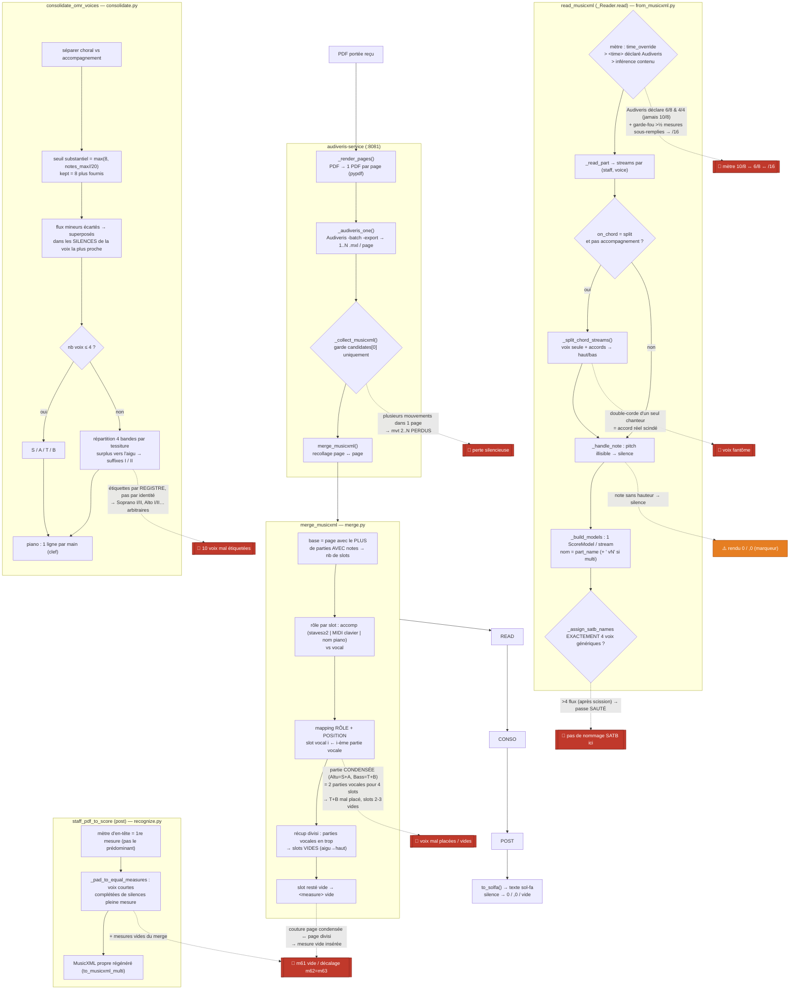

# Cartographie du pipeline OMR portée → sol-fa

> **But** : comprendre en détail comment un MusicXML produit par **Audiveris** est traité
> après réception, jusqu'au texte sol-fa. Les points de fragilité repérés sur *Jubilate Deo*
> (`docs/feedback.md`) sont marqués 🔴.
>
> Portée du document : **diagnostic**, pas de correctif. Voir aussi
> `docs/architecture.md` (§5 Pipeline A) et la mémoire `audiveris-config-limits`.

## ⚠️ Ce que voit la prod ≠ un export « book » d'Audiveris

Un export Audiveris du **book entier** est découpé en **mouvements** (1 `.mxl` par mouvement,
aux structures de parties incompatibles : `Altu/Bass/Piano` vs `Voice×4/Piano` vs `A/B/Piano`).
**Mais la prod ne reçoit jamais ça ainsi** : `audiveris-service` **redécoupe le PDF page par page**,
lance Audiveris sur *chaque page*, puis refait la fusion elle-même. Le vrai flux est donc
`page → page → merge maison`, pas « 3 mouvements en entrée ».

## Vue d'ensemble du flux

## Détail étape par étape (avec `fichier:ligne`)

### 1. Réception brute — `audiveris-service/app/main.py`
- `_collect_musicxml` (`main.py:129`) ne garde que **`candidates[0]`** (1er `.mxl` trié).
  🔴 Si Audiveris découpe **une page** en plusieurs mouvements → les autres sont **perdus**.
- `.mxl` (ZIP) décompressé via `_unzip_mxl`.

### 2. `merge_musicxml` — `merge.py:131` — **point de bascule principal**
1. Base = page avec le **plus de parties porteuses de notes** (`merge.py:167-174`) → fixe le nb de slots.
2. Rôle par slot via `_part_meta` (`merge.py:94`) : `accomp` = `staves≥2` **ou** MIDI clavier **ou** nom piano.
3. **Mapping RÔLE + POSITION** (`merge.py:201-211`) : slot vocal *i* ← *i*-ème partie vocale.
   🔴 Une partie **condensée** (`Altu`=S+A, `Bass`=T+B) = 2 parties vocales pour 4 slots →
   T+B tombe dans « Alto », slots 2-3 vides.
4. Récup divisi (`merge.py:223-238`) : parties vocales **en trop** → slots **vides** (aigu→haut).
   Ne couvre **pas** le cas « partie condensée ».
5. Slot vide → `<measure>` vide (`merge.py:242-247`).
   🔴 À la couture condensé↔divisi → mesure vide → **décalage m61 vide / m62 = m63**.

### 3. `read_musicxml` / `_Reader.read` — `from_musicxml.py:484`
- **Mètre** (`l.495-516`) : `time_override` > `<time>` déclaré > inférence contenu.
  🔴 Audiveris déclare 6/8 & 4/4 → si un `<time>` d'ouverture existe, la dérivation contenu est
  **désactivée** → bascules. Garde-fou (`l.909-937`) : >½ mesures sous-remplies → mètre **dérivé en /16**.
- `_read_part` (`l.696`) : notes groupées par `(staff, voice)` → `streams`.
- `_split_chord_streams` (`l.1043`) : si `on_chord="split"` et **pas** accompagnement (`role_accomp`, `l.952`),
  une voix **seule sur sa portée avec accords** → scindée **haut/bas** ; **pas** si voix sœur substantielle.
  🔴 Asymétrie jubilate : `Bass` scindé, `Altu` non (a une sœur).
- `_handle_note` (`l.1026`) : `pitch=None` → **silence** → `0`/`,0` en aval.
- `_build_models` (`l.1095`) : **1 `ScoreModel` par `(staff,voice)`** ; nom `part_name` (+ ` vN` si multi) ;
  doh-octave par voix pour minimiser les marques (`l.1179`).
- `_assign_satb_names` (`l.1621`) : renomme S/A/T/B **seulement si EXACTEMENT 4 voix génériques**.
  🔴 >4 flux après scission → **sauté**.

### 4. `consolidate_omr_voices` — `consolidate.py:179`
1. Choral vs accompagnement (`_is_accompaniment`, `l.23`).
2. Seuil substantiel `max(8, notes_max//20)` (`l.199`) ; `kept` = 8 plus fournis.
3. Flux mineurs écartés → **superposés dans les silences** de la voix la plus proche (`_overlay_notes`, `l.62`).
4. `_name_voices` (`l.144`) : tri tessiture ↓ ; ≤4 → S/A/T/B ; **>4 → 4 bandes, surplus vers l'aigu, suffixes I/II**.
   🔴 **Naissance des 10 voix mal étiquetées** (par registre, pas par identité).
5. Piano : `_select_piano_lines` (`l.130`) → 1 ligne/main.

### 5. `staff_pdf_to_score` (post) — `recognize.py:186`
- Mètre d'en-tête = **1re mesure** de `models[0]` (`l.229`).
- `_pad_to_equal_measures` (`l.23`) : voix courtes complétées de silences pleine mesure. 🔴 renforce les trous.
- MusicXML « propre » régénéré (`to_musicxml_multi`).

### 6. `to_solfa`
Chaque `ScoreModel` → texte sol-fa ; silences → `0` / `,0` / vide.

## Comment ça se passe dans les autres cas (branches)

| Cas d'entrée | Chemin | Résultat |
|---|---|---|
| 4 portées SATB séparées, propres | 4 flux génériques → `_assign_satb_names` | ✅ idéal |
| **SATB condensé (2 portées)** | mapping positionnel + scission asymétrique | 🔴 cas jubilate |
| Vrai divisi (S se divise) | flux surnuméraires substantiels **gardés** | Soprano I/II légitimes |
| Double-corde d'un seul chanteur | `_split_chord_streams` scinde | 🔴 voix fantôme |
| Piano / grand portée | `role_accomp` → non scindé ; `_select_piano_lines` | 1 ligne/main |
| Plusieurs mouvements dans une page | `candidates[0]` | 🔴 perte silencieuse |
| `time_override=(10,8)` fourni | force le mètre partout | ✅ contourne le mètre faux |
| Note sans hauteur (bruit OMR) | → silence | `0`/`,0` (marqueur, conforme règle §7) |
| Changement d'armure (A→B, Doh=B) | supporté, reporté par mesure | ✅ modulation gérée |
| >½ mesures sous-remplies | garde-fou → mètre **dérivé /16** | ⚠️ signatures exotiques |
| Agrément / triolets | agrément **ignoré** ; grille ×3 si triolet réel | partiel |

## Trois leviers, par ordre d'impact

1. 🔴 **`merge.py` — mapping positionnel** (`l.201-211`) : ne sait pas qu'une partie condensée = 2 pupitres.
   → mauvaise place + slots vides + décalage aux coutures. **Levier n°1** (dé-condensation avant mapping).
2. 🔴 **Double nommage par tessiture** (`_assign_satb_names` sauté si >4, puis `_name_voices`) :
   l'identité SATB d'origine est perdue → étiquettes I/II arbitraires. **Levier n°2** (mapper par identité).
3. 🔴 **Mètre Audiveris faux non neutralisé** sans `time_override` : bascules 10/8 ↔ 6/8 ↔ /16.
   **Levier n°3** (le plus simple à mitiger : forcer le mètre).
